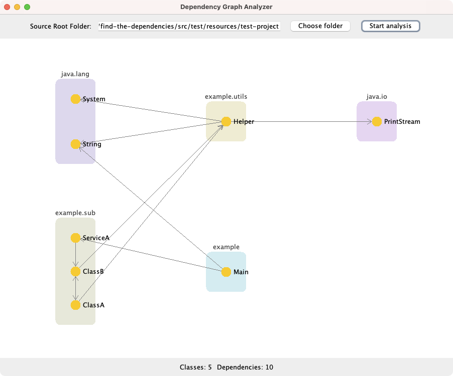

# Assignment 2

Giangiulli Chiara (1189567; chiara.giangiulli@studio.unibo.it)  
Shtini Dilaver (1189997; dilaver.shtini@studio.unibo.it)  
Terenzi Mirco (1193420; mirco.terenzi@studio.unibo.it)  
12 Maggio 2025

## Indice

- [Analisi del problema](#analisi-del-problema)
- [Design e Architettura](#design-e-architettura)
- [Comportamento del sistema](#comportamento-del-sistema)

## Analisi del problema
Il progetto ha come obiettivo l'analisi delle dipendenze tra classi, interfacce e package in un’applicazione Java, ovvero identificare da quali elementi del codice dipendono le porzioni analizzate.

L’analisi delle dipendenze è un’operazione potenzialmente costosa in termini computazionali, soprattutto su repository di grandi dimensioni.
La difficoltà non riguarda solo l’analisi dei singoli file, ma anche la combinazione dei risultati in modo coerente.

Per affrontare queste problematiche, lo sviluppo prevede due soluzioni distinte, ciascuna basata su un approccio differente:

- **Asincrono**: è richiesta la realizzazione di una libreria in grado di operare a tre diverse profondità: sull’intero progetto, su un singolo package o su una specifica classe, con l’obiettivo di identificare le relative dipendenze. Le operazioni su ciascuno di questi livelli devono essere eseguite in modo indipendente e non bloccante. 
  
- **Reattivo**: è previsto lo sviluppo di un'interfaccia grafica che permetta all’utente di avviare l’analisi delle dipendenze e visualizzare in modo dinamico e incrementale i risultati ottenuti per il progetto selezionato. Le relazioni devono essere mostrate sotto forma di grafo, eventualmente raggruppando le classi nei rispettivi package. I componenti devono reagire automaticamente a eventi esterni o modifiche di stato. In questo modello, i risultati si propagano come un flusso di valori nel tempo, anziché in un unico momento, permettendo all’utente finale di visualizzare l’avanzamento in tempo reale. L’interfaccia deve includere due pulsanti (uno per selezionare la _root folder_ del progetto e uno per avviare l’analisi), una sezione per la visualizzazione del grafo e due contatori (uno per il numero di classi analizzate e uno per il numero di dipendenze individuate).

## Design e Architettura
Il sistema si articola in due componenti principali:

### DependencyAnalyzerLib
Utilizza un event loop asincrono per la gestione delle richieste, implementato attraverso l'utilizzo del framework _Vert.x_, consente l’esecuzione non bloccante delle analisi.
Offre tre metodi principali:

- _getClassDependencies(File classSrcFile) → Future<ClassDepsReport>_ : fornisce un report contenente le dipendenze della classe specificata in _classSrcFile_.

- _getPackageDependencies(File packageSrcFolder) → Future<PackageDepsReport>_ : fornisce un report contenente le dipendenze specifiche delle classi contenute nel package specificato in _packageSrcFolder_.

- _getProjectDependencies(File projectSrcFolder) → Future<ProjectDepsReport>_ : fornisce un report contenente tutte le dipendenze delle classi nel progetto specificato in _projectSrcFolder_.

I metodi elencati sono asincroni e restituiscono un _Future_, il che implica che il risultato di ciascuno di essi viene utilizzato solo quando è disponibile. In particolare, il metodo _getProjectDependencies_ invoca _getPackageDependencies_, che a sua volta, seguendo lo stesso approccio asincrono, chiama internamente il metodo _getClassDependencies_.
L'output prodotto è strutturato in oggetti _DepsReport_ che rappresentano le dipendenze tra elementi.

Utilizza _JavaParser_ per analizzare i file sorgente e costruire l’AST (Abstract Syntax Tree).

### DependencyAnalyzer
È il componente responsabile della gestione reattiva del sistema, coordina flussi di eventi multipli (come input dell’utente, aggiornamenti dell’interfaccia grafica e ricezione dei risultati) attraverso l’utilizzo di _ReactiveX_ (_RxJava_).

La GUI è composta di tre componenti:

- Selettore della root del progetto.
- Pulsante di avvio analisi.
- Pannello visualizzazione dipendenze (grafo interattivo).
- Due contatori per tenere traccia delle classi analizzate e delle dipendenze trovate.

	

L'interfaccia grafica permette di visualizzare dinamicamente l'analisi: le classi vengono analizzate e le dipendenze trovate sono progressivamente aggiunte nel grafo, raggruppate in base al package di appartenenza.

Viene seguito un pattern MVC per garantire separazione tra interfaccia grafica e logica applicativa, attraverso l'utilizzo di un _Controller_ che collega le due parti.

## Comportamento del sistema
### DependencyAnalyzerLib
### DependencyAnalyzer
