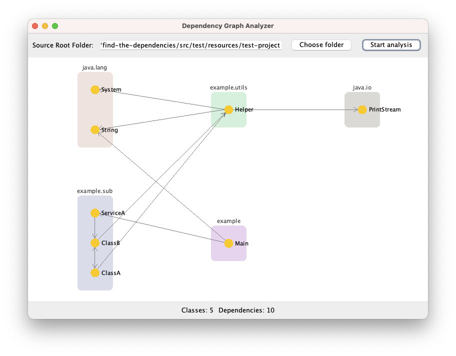
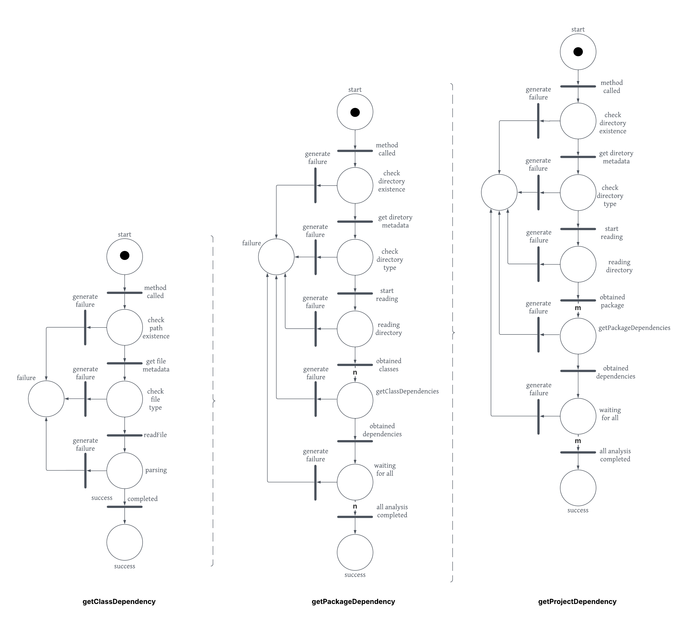

# Assignment 2

Giangiulli Chiara (1189567; chiara.giangiulli@studio.unibo.it)  
Shtini Dilaver (1189997; dilaver.shtini@studio.unibo.it)  
Terenzi Mirco (1193420; mirco.terenzi@studio.unibo.it)  
12 Maggio 2025

## Indice

- [Analisi del problema](#analisi-del-problema)
- [Design e Architettura](#design-e-architettura)
- [Comportamento del sistema](#comportamento-del-sistema)

## Analisi del problema
Il progetto ha come obiettivo l'analisi delle dipendenze tra classi, interfacce e package in un’applicazione Java, 
ovvero identificare da quali elementi del codice dipendono le porzioni analizzate.

L’analisi delle dipendenze è un’operazione potenzialmente costosa in termini computazionali, soprattutto su repository di grandi dimensioni.
La difficoltà non riguarda solo l’analisi dei singoli file, ma anche la combinazione dei risultati in modo coerente.

Per affrontare queste problematiche, lo sviluppo prevede due soluzioni distinte, ciascuna basata su un approccio differente:

- **Asincrono**: è richiesta la realizzazione di una libreria in grado di operare a tre diverse profondità: 
sull’intero progetto, su un singolo package o su una specifica classe, con l’obiettivo di identificare le relative dipendenze. 
Le operazioni su ciascuno di questi livelli devono essere eseguite in modo indipendente e non bloccante.

- **Reattivo**: è previsto lo sviluppo di un'interfaccia grafica che permetta all’utente di avviare l’analisi delle dipendenze
e visualizzare in modo dinamico e incrementale i risultati ottenuti per il progetto selezionato. 
Le relazioni devono essere mostrate sotto forma di grafo, eventualmente raggruppando le classi nei rispettivi package. 
I componenti devono reagire automaticamente a eventi esterni o modifiche di stato. 
In questo modello, i risultati si propagano come un flusso di valori nel tempo, anziché in un unico momento, permettendo all’utente finale di 
visualizzare l’avanzamento in tempo reale. 
L’interfaccia deve includere due pulsanti (uno per selezionare la _root folder_ del progetto e uno per avviare l’analisi), 
una sezione per la visualizzazione del grafo e due contatori (uno per il numero di classi analizzate e uno per il numero di dipendenze individuate).

## Design e Architettura

### Libreria asincrona
Il progetto è basato sull’utilizzo del framework [Vert.x](https://vertx.io/), che fornisce un’infrastruttura asincrona basata 
su un event loop interno. Questo permette di eseguire operazioni (come lettura file e parsing) in modo non-bloccante, 
garantendo reattività, senza dover gestire direttamente thread o concorrenza. La libreria `DependencyAnalyserLib` espone 
tre metodi principali:

- `getClassDependencies(File classSrcFile): Future<ClassDepsReport>` fornisce un report contenente tutte le dipendenze 
della classe specificata tramite il path, passato come parametro;
- `getPackageDependencies(File packageSrcFolder): Future<PackageDepsReport>` analizza le dipendenze del package in 
ingresso, in particolare processando ogni classe a esso appartenente;
- `getProjectDependencies(File projectSrcFolder): Future<ProjectDepsReport>` restituisce una lista di dipendenze per 
ogni classe all'interno di un determinato progetto.

Tutti i metodi ritornano oggetti _Future_: i risultati delle analisi vengono gestiti tramite callback (_onSuccess_, _onFailure_, _onComplete_) che vengono eseguite solo al termine dell’elaborazione, senza 
bloccare l’esecuzione del programma.

I risultati sono modellati da tre classi (`ClassDepsReport`, `PackageDepsReport`, `ProjectDepsReport`) che estendono una classe 
astratta generica `DepsReport<T>`. Questo design permette una composizione strutturata dei report: un report di progetto 
aggrega report di package, e ciascun report di package aggrega quelli delle classi.
In particolare, il metodo _getProjectDependencies_ invoca _getPackageDependencies_, che a sua volta, 
seguendo lo stesso approccio asincrono, chiama internamente il metodo _getClassDependencies_.

Infine, l’utilizzo della libreria [JavaParser](https://javaparser.org) consente di analizzare il codice sorgente Java 
tramite Abstract Syntax Tree (AST).

### Programma reattivo
È il componente responsabile della gestione reattiva del sistema, coordina flussi di eventi multipli 
(come input dell’utente, aggiornamenti dell’interfaccia grafica e ricezione dei risultati) attraverso l’utilizzo di _ReactiveX_ (_RxJava_).

L'architettura è basata su un pattern Model-View-Controller (MVC), che separa la logica 
dell'applicazione dalla presentazione. La parte di analisi delle dipendenze è implementata nella classe 
`DependencyAnalyser`, che fornisce le funzionalità di analisi, mentre la parte di interfaccia grafica è gestita dalla
classe `GUI`, realizzata utilizzando la libreria [Swing](https://docs.oracle.com/javase/7/docs/api/javax/swing/package-summary.html)
di Java.

Il progetto utilizza il framework [RxJava](https://github.com/ReactiveX/RxJava) per implementare la programmazione
reattiva. RxJava è una libreria per la programmazione reattiva in Java, che consente di lavorare con flussi di dati
asincroni e di gestire eventi in modo reattivo. La libreria fornisce un'implementazione del pattern Observer, che
permette di osservare e reagire a eventi o cambiamenti di stato in modo semplice ed efficiente.

	

La GUI è progettata per essere reattiva, consentendo all'utente di selezionare un progetto e visualizzare le
dipendenze in modo dinamico, man mano che le varie classi vengono analizzate. La disposizione dei nodi nel grafo 
è gestita raggruppando le classi in package, in modo da rendere più chiara la visualizzazione delle dipendenze.

All'interno del programma, è implementata una semplice gestione della backpressure, che consente di limitare il numero
di eventi emessi in un dato momento, evitando sovraccarichi e garantendo una reattività fluida. Questo è realizzato
tramite la definizione di una dimensione massima per il buffer degli eventi, che controlla quanti eventi possono
essere emessi prima di essere elaborati. In futuro, il progetto potrebbe essere esteso per includere una gestione
più avanzata della backpressure, ad esempio gestendo la frequenza di emissione degli eventi.

## Comportamento del sistema
### Libreria asincrona

	

- _n_: numero di classi nel package
- _m_: numero di package nel progetto

### Programma reattivo
